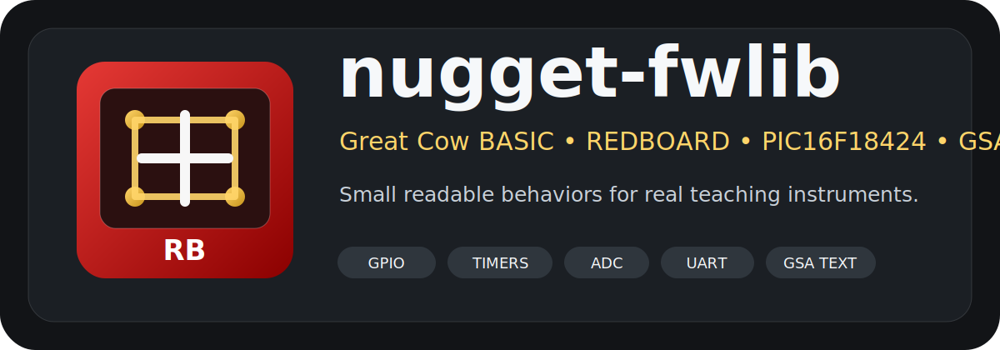

# nugget-fwlib

**A Great Cow BASIC firmware library for REDBOARD, PIC Black Box, and GSA teaching instruments.**



## What this is

`nugget-fwlib` is a small, readable firmware framework for the PIC16F18424. It is designed for the REDBOARD / PIC Black Box / Nugget pathway and for the larger GSA idea:

> **555 logic → PIC behavior → serial protocol → dashboard instrument → UMA/GSA node**

The library is organized around **behavior classes**, not random snippets.

## Why it exists

The purpose is not to hide the microcontroller. The purpose is to make its behavior understandable.

> If the student cannot understand the magic, it does not help.

Each module tries to explain:

1. What the electricity means.
2. What the software does.
3. What the classroom behavior is.
4. How it fits into a real instrument.

## Primary target

```gcb
#chip 16F18424
#option Explicit
#config LVP = ON
#config MCLRE = ON
```

## Library families

| Folder | Behavior class |
|---|---|
| `arch/` | chip-specific setup |
| `boards/` | REDBOARD pin map and board identity |
| `gpio/` | digital I/O, LED, switch, debounce, latch |
| `timing/` | delay, heartbeat, stopwatch, cooperative service style |
| `analog/` | ADC and PWM/pseudo-DAC |
| `comms/` | UART and GSA text protocol |
| `data/` | line buffers, CSV, key/value text |
| `devices/` | sensor/device wrappers |
| `diagnostics/` | fault codes, blink codes, self-test |
| `examples/` | classroom and instrument examples |
| `tools/` | Web Serial dashboard and Python serial logger |

## GSA tiny text protocol

Tiny PIC devices do not need JSON. They need a disciplined, line-oriented language:

```text
HELLO
STATUS
START
STOP
RESET
TARE
READ
DEMO ON
```

Responses are also simple:

```text
ID NUGGET-REDBOARD PIC16F18424 FW=0.1.0
OK STATUS READY
OK START
DATA ADC 512
FAULT HX711_MISSING
ERR BAD_CMD
```

## Recommended learning sequence

1. Blink an LED.
2. Read a switch-to-ground input.
3. Add internal weak pull-up logic.
4. Add debounce.
5. Convert switch state into a one-shot event.
6. Build a one-bit latch.
7. Add timing and reaction measurement.
8. Read ADC.
9. Print CSV over UART.
10. Add GSA command words.
11. Add diagnostics and fault messages.
12. Build a complete tiny instrument.

## Version

Current release: **v0.1.0**

This is a GitHub-ready teaching seed release. It is intentionally explicit, heavily commented, and conservative.
